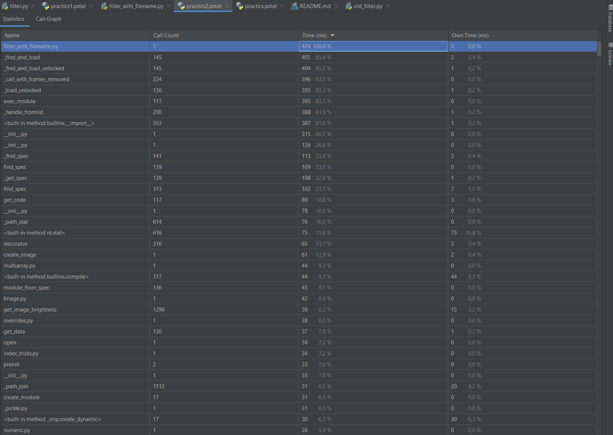

# practics

## filter.py

Наибольшее время отнял ввод данных в консоль, сами функции сделали 1296 вызовов, функция сбора фотографии сделала 1 вызов.
В сумме выполнение функций заняло ~60 миллисекунд

## old_filter.py

Функций в скрипте нет, поэтому показывается общее время выполнения скрипта, которое занимает ~1100 миллисекунд, на первый взгляд работает быстрее, без учета ввода данных, работает в десятки раз медленнее.

## filter_with_filename.py

Теперь данные введены напрямую в скрипте, общее время выполнения сократилось до 474 миллисекунд, что в 2 раза меньше, чем изначальная реализация